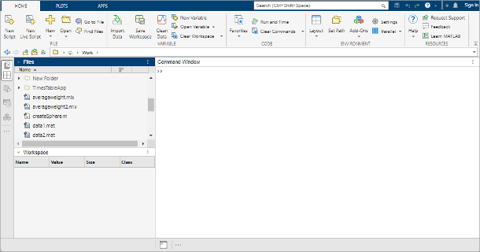

## Desktop Basics

To start Matlab in a UCL terminal go to `UCL Applications Store`
and type `matlab` in the search bar. Select `Matlab 2025a`.
When you start MATLAB®, the desktop appears in its default
layout.



The desktop includes these areas:

* Files panel — Access your files.
* Workspace panel — Explore data that you create or import from
  files.
* Command Window — Enter commands at the command line, indicated by the
  prompt (`>>`).
* Sidebars — Access tools docked in the desktop and additional
  panels.

As you work in MATLAB, you issue commands that create variables
and call functions. For example, create a variable named `a` by
typing this statement at the command line:

```
a = 1
```

MATLAB adds variable `a` to the workspace
and displays the result in the Command Window.

```
a = 

     1
```

Create a few more variables.

```
b = 2

```

```
b = 

     2
```

```
c = a + b
```

```
c = 

     3
```


When you do not specify an output variable, MATLAB uses
the variable `ans`, short for *answer*,
to store the results of your calculation.

```
sin(a)
```

```
ans =

    0.8415
```

If you end a statement with a semicolon, MATLAB performs
the computation, but suppresses the display of output in the Command
Window.

```
e = a*b;
```

You can recall previous commands by pressing the up- and down-arrow
keys, ↑ and ↓. Press the arrow keys either at an empty
command line or after you type the first few characters of a command.
For example, to recall the command `b = 2`, type `b`,
and then press the up-arrow key.

